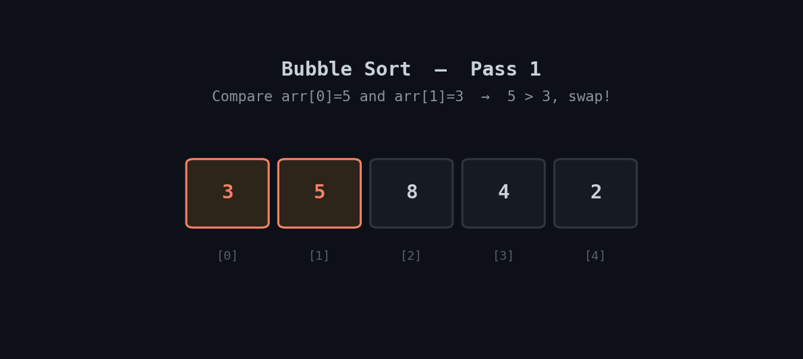

<h1 align="center">🫧 Bubble Sort</h1>

<p align="center">
  <i>An animated, beginner-friendly walkthrough of the Bubble Sort algorithm with a clean Python implementation.</i>
</p>

<p align="center">
  
  
  
</p>

---

## 📽️ Visual Walkthrough

Bubble Sort repeatedly compares **adjacent elements** and swaps them if they're in the wrong order. On each full pass through the array, the largest remaining unsorted value "bubbles up" to its correct position at the end.

<p align="center">
  
</p>

> 🟡 Amber = comparing, no swap needed · 🟠 Orange = comparing, swap happening · 🟢 Green = locked in final sorted position

---

## ⚙️ How It Works

1. Go through the array comparing each pair of adjacent elements.
2. If the left element is greater than the right, swap them.
3. After one full pass, the largest unsorted value is guaranteed to be at the end — it's now locked.
4. Repeat for the remaining unsorted portion of the array.
5. If a full pass completes with **no swaps**, the array is already sorted — stop early.

---

## ⏱️ Complexity

| Case | Time | Space |
|---|---|---|
| Best (already sorted) | `O(n)` | `O(1)` |
| Average | `O(n²)` | `O(1)` |
| Worst (reverse sorted) | `O(n²)` | `O(1)` |

The early-exit check (`if not swapped: break`) is what gives Bubble Sort its best-case `O(n)` — without it, every case would cost `O(n²)` regardless of how sorted the input already is.

---

## 🐍 Implementation

```python
def bubble_sort(arr):
    n = len(arr)
    for i in range(n):
        swapped = False
        # last i elements are already in place
        for j in range(n - i - 1):
            if arr[j] > arr[j + 1]:
                arr[j], arr[j + 1] = arr[j + 1], arr[j]  # swap
                swapped = True
        if not swapped:  # no swaps -> already sorted
            break
    return arr


# Example
nums = [5, 3, 8, 4, 2]
print(bubble_sort(nums))  # [2, 3, 4, 5, 8]
```

> 💡 Full file: [`bubble_sort.py`](./bubble_sort.py)

---

## ▶️ Run It

```bash
git clone https://github.com/zain-cs/6-Bubble-Sort.git
cd 6-Bubble-Sort
python bubble_sort.py
```

---

## 🔁 Where Bubble Sort Fits

| | Bubble Sort | Typical use |
|---|---|---|
| Time complexity | `O(n²)` average/worst, `O(n)` best | Teaching sorting concepts, tiny or nearly-sorted datasets |
| Space complexity | `O(1)` — sorts in place | — |
| Stable? | ✅ Yes — equal elements keep their relative order | Useful when order of duplicates matters |

Bubble Sort is rarely used in production due to its `O(n²)` average case — but it's one of the clearest ways to learn how comparison-based sorting and in-place swapping work.

---

## 🗺️ Part of a DSA Series

📌 [Linear Search](https://github.com/zain-cs/1-Linear-Search) → [Binary Search](https://github.com/zain-cs/2-Binary-Search) → [Ternary Search](https://github.com/zain-cs/3-Ternary-Search) → [Jump Search](https://github.com/zain-cs/4-Jump-Search) → [Exponential Search](https://github.com/zain-cs/5-Exponential-Search) → **Bubble Sort** → more to come as I work through DSA.

---

<p align="center">
  Made with 🐍 by <a href="https://github.com/zain-cs">Muhammad Zain Ul Abidin</a>
</p>
